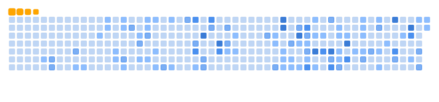

  

<b>Hello, my name is Stepan Potiienko. I am glad to have you on my Github Page. I focus primarily on Python and Web Applications. 
If you'd like to find out more about Data Structures and Algorithms (or even contribute yourself), please make sure to check out the repository, mentioned below. </b>

<table>
  <thead align="center">
    <tr border: none;>
      <td><b>📘 Projects </b></td>
      <td><b>⭐ Stars </b></td>
      <td><b>🤝 Forks</b></td>
    </tr>
  </thead>
  <tbody>
    <tr>
      <td><a href="[https://github.com/madushadhanushka/differ](https://github.com/StepanPotiienko/data-structures-and-algorithms)"><b>💻 Data Structures and Algorithms</b></a></td>
      <td></td>
      <td></td>
    </tr>
    <tr>
      <td><a href="[https://github.com/madushadhanushka/differ](https://github.com/StepanPotiienko/go-speedtest)"><b>🛜 Go Speedtest</b></a></td>
      <td></td>
      <td></td>
    </tr>
     <tr>
      <td><a href="[https://github.com/madushadhanushka/differ](https://github.com/StepanPotiienko/wave-modulator)"><b>🌊 Wave Modulator</b></a></td>
      <td></td>
      <td></td>
    </tr>
     <tr>
      <td><a href="[https://github.com/madushadhanushka/differ](https://github.com/StepanPotiienko/py-image-editor)"><b>📸 Py Image Editor</b></a></td>
      <td></td>
      <td></td>
    </tr>
  </tbody>
</table>

<picture>
  <source media="(prefers-color-scheme: dark)" srcset="github-snake-dark.svg" />
  <source media="(prefers-color-scheme: light)" srcset="github-snake.svg" />
  
</picture>
